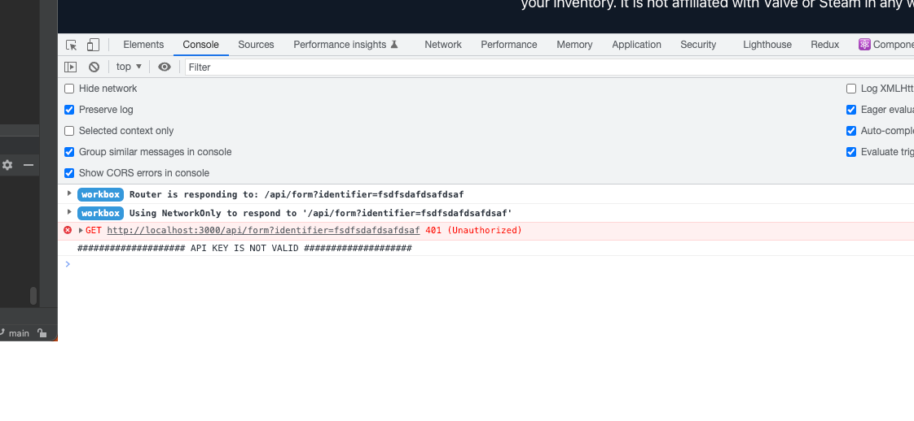

## Steam Inventory Worth Calculator

This project is a simple web app that calculates the total worth of a Steam user's inventory. 

It uses the [steamwebapi.com](https://www.steamwebapi.com) to fetch the prices of each item and fetch the Inventory.
Its a Free Steam Api Service that provides the prices of each item in the Steam Community Market.

## Live / Demo here
https://www.csbackpack.net [From Forked Repo (not related with us)]

https://inventory.steamwebapi.com [From Original Repo]

## Todos & Wishes (Feel free to contribute)n
- Add History of last crawled Inventories with MonogoDB or something else
- Better SEO for all
- Better Mobile Support
- Inspect Items in Inventory

## You can also use the API
Just go to www.steamwebapi.com and use the API for free.

## You can contribute to this project
If you want to contribute to this project, just fork it and make a pull request.

## Getting Started

First, run the development server:

```bash
npm run dev
```

## Error

If you dont have an API KEY you will become this error, be careful that a API KEY is exists in .env



Open [http://localhost:3000](http://localhost:3000) with your browser to see the result.

## Built With

- Next.js - The React Framework for Production
- Tailwind CSS - A utility-first CSS framework for rapidly building custom designs
- Chakra UI - A simple, modular and accessible component library that gives you the building blocks you need to build your React applications
- DaisyUI - A component library for Tailwind CSS & React


## ON ERROR - Vercel Edge Functions
This Project use Vercel Edge Functions, that means that the API KEY is not visible in the Frontend. And you need to add the
.env variables to the Vercel Project on vercel.com.
